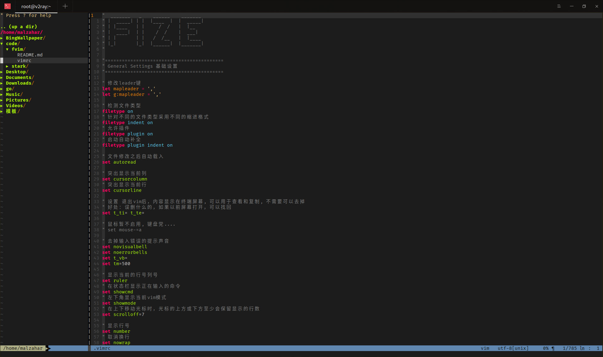

# fvim

## 介绍

自己用的vimrc配置，参考了其他两个配置[vim-vide](https://github.com/bilibili/vim-vide),[k-vim](https://github.com/wklken/k-vim)

更详细的配置可以查看vimrc文件

## 安装

1.安装依赖包

    # ubuntu
    sudo apt-get install ctags
    sudo apt-get install build-essential cmake python-dev  #编译YCM自动补全插件依赖
    sudo apt-get install silversearcher-ag

    # centos,fedora(dnf)
    sudo yum install python-devel
    sudo yum install epel-release
    sudo yum install the_silver_searcher
    sudo yum install cmake

    # mac
    brew install ctags
    brew install the_silver_searcher

2.执行安装

    cd fvim
    ./install.sh

### 注意

vimrc文件中安装了一些自己用到的插件，如果觉得没有用可以注释或删除掉，在安装vim-go插件的时候会安装一些go的二进制文件，
这些包有可能需要开启代理才能访问，所以开启终端代理即可，如果不需要做go开发可以直接注释掉
